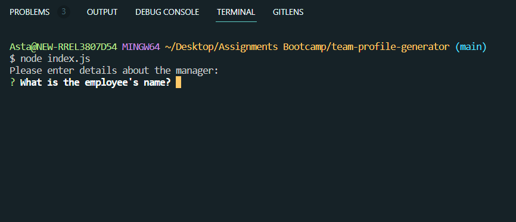
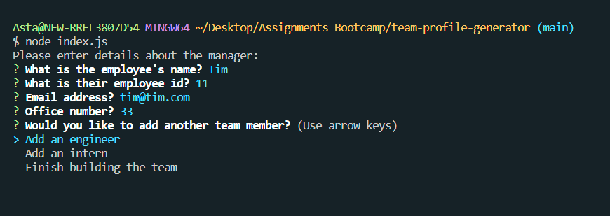
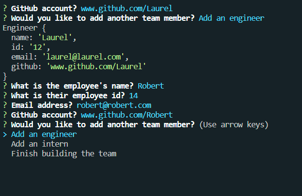
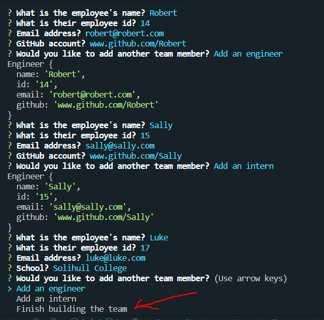
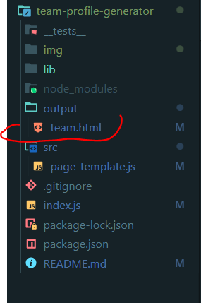
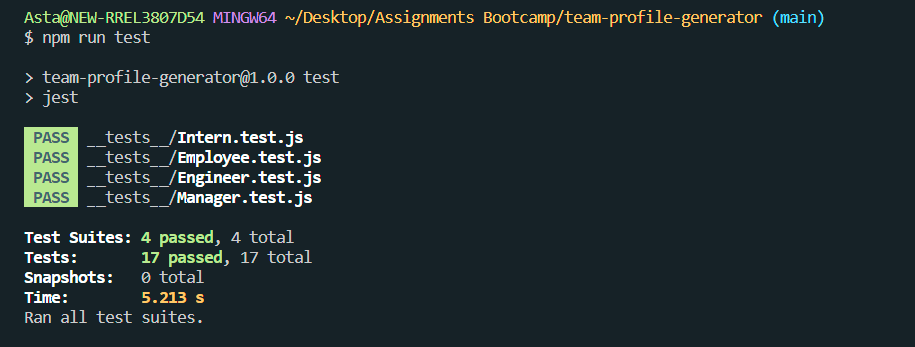

# Team profile generator 

### Description

Purpose of the app - get the user input in terminal/command prompt and generate HTML file with this information.

User is asked series of questions. 

Based on the answers, html file is generated and each team's member's details are displayed on it's own card.

### Here is the demonstration how the app works

This app runs in terminal/command line. 

At the beginning questions about the manager are asked:

After answering questions about the Manager, user is asked would they like to add another team member - engineer or intern:

After adding second tem member (Engineer in this case), user is asked if they would like to add more:

User can add as many engineers and interns as they need.

Once all team members are added, user chooses "Finish building the team" option: 

New HTML file team.html is generated and saved in output folder:

Team members details are generated from the input the user provided. 

Open team.html file in browser. Each team member's details are displayed on it's own card:

## Languages, tools, libraries/frameworks used

- Javascript
- Node.js
- npm Inquirer package
- Jest 
- Bootstrap
- HTML

## Installation

To run this project you will need Node.js installed on your local machine.

After installing Node.js, in your terminal or command prompt - navigate to the team-profile-generator folder, run
`npm install` command to install all dependencies.

## Usage

App runs in terminal/command prompt. Run `node index.js`, press enter. 

The question about manager will appear, type your answer, press enter and repeat till you answer all questions about the manager. 

After that what next team member you would like to add. 

Repeat the process, untill all team members are added. 

Choose "Finish building a team option".

Navigate to output folder and open team.html file in browser. 
## Tests

Tests are pre-written for this application. 

Test suite is checking functionality and behavior of Employee, Engineer, Intern and Manager classes.

To run the tests, run `npm run test` in terminal/command prompt.
With the current state of application, all tests pass:

